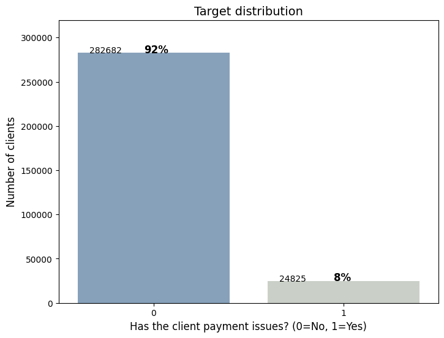
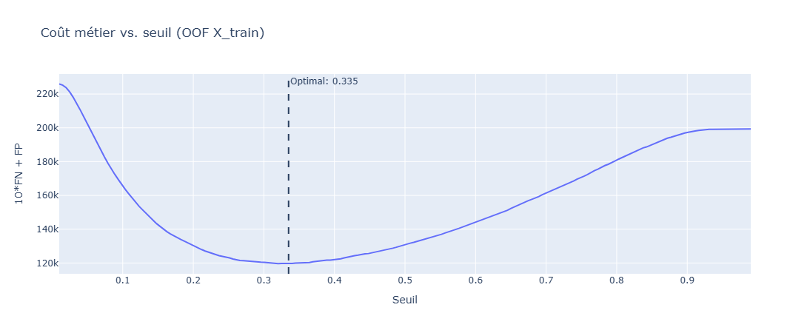
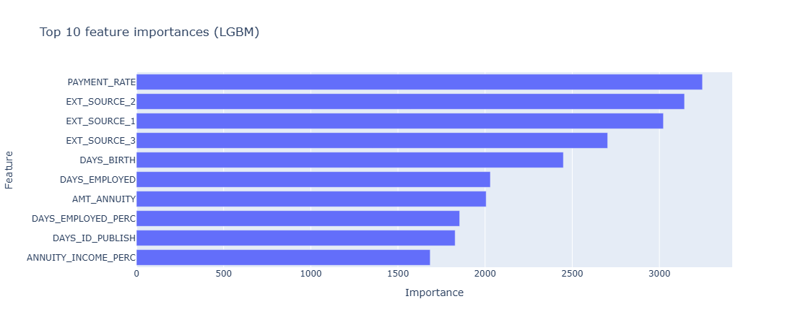

# Projet OC P6 — Scoring de crédit
## Home Credit Default Risk

---

## 1. Contexte & Objectif

**Contexte métier**

Home Credit est une institution financière qui accorde des prêts à des clients divers. L'enjeu est double : ne pas refuser des bons clients, mais ne pas accorder de prêts à des clients qui sont susceptibles de faire défaut.

**Objectif**

Prédire la probabilité de défaut de remboursement d'un client (`TARGET = 1`).

**Contrainte métier**

Un faux négatif (défaut non détecté) coûte 10× plus qu'un faux positif (bon client refusé) :

```
Coût = 10 × FN + FP
```

Cette asymétrie guide tous les choix de modélisation (métrique d'optimisation, seuil de décision).

---

## 2. Données

**8 sources de données** fusionnées au niveau client (`SK_ID_CURR`) :

| Source | Description |
|---|---|
| `application_train/test.csv` | Données principales de la demande de prêt |
| `bureau.csv` + `bureau_balance.csv` | Historique crédit auprès d'autres institutions |
| `previous_application.csv` | Demandes passées chez Home Credit |
| `POS_CASH_balance.csv` | Historique des paiements POS/cash |
| `installments_payments.csv` | Paiements d'échéances |
| `credit_card_balance.csv` | Soldes cartes de crédit |

**Caractéristiques du dataset final**
- ~307 000 clients, ~770 features après feature engineering
- Déséquilibre de classes : **~8% de défauts** (TARGET=1)
- Valeurs manquantes nombreuses (NaN fréquents sur les sources secondaires)




## 3. Feature Engineering

Réalisé dans `notebooks/EDA.ipynb` :

- **Agrégations** des tables secondaires (mean, sum, min, max, var) par `SK_ID_CURR`
- **Ratios** construits manuellement (`AMT_CREDIT / AMT_INCOME`, `DAYS_EMPLOYED / DAYS_BIRTH`, etc.)
- **Encodage** des variables catégorielles (one-hot)
- **Nettoyage** : remplacement des `inf` par `NaN` (divisions par zéro sur certains ratios)

Résultat : **~770 colonnes** après merge des 8 sources.

---

## 4. Comparaison des modèles

Expérience `"First trial"` dans MLflow — 5 modèles évalués en cross-validation stratifiée 5 folds avec sample weights et optimisation du seuil.

**Protocole**

- Cross-validation stratifiée 5 folds
- `compute_sample_weight("balanced")` pour compenser le déséquilibre
- Seuil optimal par fold (maximise Fbeta β=1.5, recall favorisé)

**Résultats comparatifs (dataset complet — sample weights + seuil optimal)**

| Modèle | ROC-AUC | PR AUC | Recall | Fbeta (β=1.5) | Coût CV |
|---|---|---|---|---|---|
| LightGBM | 0.78 | 0.27 | 0.67 | 0.38 | 24 356 |
| Logistic Regression | 0.77 | 0.25 | 0.68 | 0.37 | 25 067 |
| XGBoost | 0.76 | 0.25 | 0.68 | 0.36 | 25 697 |
| MLP | 0.75 | 0.23 | 0.63 | 0.35 | 26 426 |
| Random Forest | 0.73 | 0.20 | 0.60 | 0.33 | 27 982 |

**→ LightGBM retenu** comme meilleur modèle pour l'optimisation.

---

## 5. Optimisation — LightGBM + Optuna

Réalisée dans `notebooks/Optimisation.ipynb` — expérience `OC_P6_optimisation`.

**Approche**

- **Optuna** : recherche bayésienne des hyperparamètres (50 trials sur dataset réduit, 100+ sur full)
- À chaque trial : 5-fold CV + recherche du seuil optimal sur chaque fold de validation
- Objectif Optuna : **minimiser le coût métier** `10×FN + FP`
- Sample weights `balanced` fixés

**Espace de recherche**

| Hyperparamètre | Plage |
|---|---|
| `num_leaves` | 20 – 300 |
| `learning_rate` | 0.01 – 0.3 (log) |
| `n_estimators` | 100 – 1000 |
| `min_child_samples` | 5 – 100 |
| `subsample` | 0.5 – 1.0 |
| `colsample_bytree` | 0.5 – 1.0 |
| `reg_alpha` / `reg_lambda` | 1e-8 – 10 (log) |

**Artefacts loggés dans MLflow**

- Courbe d'optimisation Optuna
- Importance des hyperparamètres
- Courbe coût vs. seuil (OOF sur X_train)
- Top 10 feature importances
- Matrice de confusion sur X_test

---

## 6. Résultats finaux


**Meilleurs hyperparamètres trouvés** (100 trials Optuna, full dataset)

| Hyperparamètre | Valeur |
|---|---|
| `num_leaves` | 264 |
| `learning_rate` | 0.0143 |
| `n_estimators` | 773 |
| `min_child_samples` | 83 |
| `subsample` | 0.877 |
| `colsample_bytree` | 0.802 |
| `reg_alpha` | 6.93 |
| `reg_lambda` | 0.47 |

**Seuil optimal final**
 evalué à 0.335



**Évaluation sur X-test** (holdout 20%, seuil optimal OOF)

| Métrique | Valeur | 
|---|---|
| ROC-AUC | 0.79 |
| PR-AUC | 0.28 |
| Recall | 0.68 |
| Precision | 0.20 |
| Fbeta (β=1.5) | 0.39 |
| Coût métier | 29 678 |


**Modèle enregistré** dans MLflow Model Registry sous `lgbm_credit_scoring`.

---

**Features les plus importantes**



`PAYMENT_RATE` — Engineered feature : Taux de remboursement annuel (annuité / credit total). Represente la vitesse de remboursement voulue du credit. 

`EXT_SOURCE_1/2/3` — scores de crédit externes fournis par des tiers partenaires de Home Credit, normalisés entre 0 et 1. Plus le score est élevé, moins le client est risqué. Ce sont les 3 features les plus prédictives du modèle final.

---

## 7. Valeur métier 

### Comparaison avec le scénario sans modèle

Sans outil de scoring, une institution a deux options naïves : 

&nbsp;&nbsp;&nbsp;**Approuver tout le monde** (maximiser le revenu, mais subir tous les défauts)

&nbsp;&nbsp;&nbsp;**Refuser sur critères grossiers** (mal calibré, perte de bons clients).

Sur le jeu de test (~61 000 clients, 8% de défauts soit ~4 900 défauts) :

| Scénario | FN (défauts non détectés) | FP (bons clients refusés) | Coût métier |
|---|---|---|---|
| Approuver tout le monde | 4 900 | 0 | **49 000** |
| Modèle (seuil optimal) | ~1 420 | ~15 900 | **29 678** |

**→ Le modèle réduit le coût métier de ~40% par rapport à l'absence de scoring.**

En d'autres termes : sur 100 défauts réels, le modèle en intercepte 71 qui auraient été financés sans outil. Chaque défaut intercepté représente un prêt non accordé à un client qui ne rembourse pas.

### Le seuil : un levier stratégique ajustable

Le modèle retourne une **probabilité** de défaut, pas une décision binaire. Le seuil de décision est un paramètre métier, pas technique :

| Stratégie | Seuil | Recall | Précision |
|---|---|---|---|
| Prudente (priorité anti-défaut) | Bas (~0.2) | Élevé (~85%) | Faible (~12%) |
| Optimisée (coût métier min.) | 0.33 | 71% | 18% |
| Commerciale (limiter les refus) | Haut (~0.5) | Modéré (~50%) | Élevée (~30%) |

Ce réglage peut être ajusté selon la conjoncture économique, l'appétit au risque, ou les objectifs commerciaux — **sans réentraîner le modèle**.

### Prêt pour la production

- Modèle versionné et reproductible via **MLflow Model Registry** (`lgbm_credit_scoring v2`)
- Pipeline de feature engineering documenté sur 8 sources de données
- Toutes les expériences tracées, comparables et auditables
- Seuil optimal calculé sur données OOF (pas de fuite sur X_test)

---

## 8. Conclusion & Perspectives

**Ce qui a été fait**
- Feature engineering sur 8 sources hétérogènes → ~770 features
- Benchmark de 5 algorithmes avec gestion du déséquilibre et optimisation du seuil
- Optimisation bayésienne des hyperparamètres LGBM avec Optuna (100 trials)
- Tracking complet des expériences avec MLflow (métriques, modèles, artefacts)

**Points clés**
- Le seuil de décision, le sample weight et l'optimisation du modèle sont des leviers importants : avec le modèle par défaut, le recall est très faible (~5%) ; avec les optimisations, il monte à ~71%
- Le coût métier asymétrique (10×FN) justifie de sacrifier de la précision pour gagner en recall

**Perspectives**
- Feature selection pour réduire les 770 features

